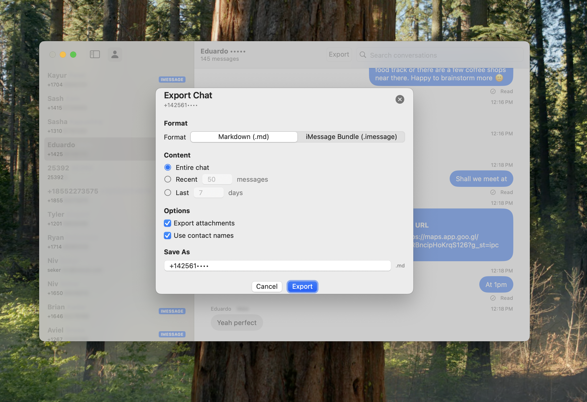

# iMessageExport

**Repository:** [https://github.com/zats/iMessageExport.git](https://github.com/zats/iMessageExport.git)

A Swift package for reading and analyzing iMessage data from the macOS Messages app database. Built with Swift 6 concurrency, it provides comprehensive semantic classification of message types.

## Features

*   **Thread-safe database access** using Swift 6 actors.
*   **Semantic message classification** for various message types (reactions, group actions, app integrations, effects).
*   **Type-safe enums** for all message variants and properties.
*   **SwiftUI-ready** data models with computed properties.
*   **Contact name lookup** for improved readability.
*   **Case and unicode insensitive search** for conversations by name or identifier.

## Installation

Add this package to your Swift project:

```swift
dependencies: [
    .package(url: "https://github.com/zats/iMessageExport.git", .upToNextMajor(from: "1.0.0"))
]
```

## Basic Usage

```swift
import iMessageExport

// Initialize with default database path
let exporter = try await iMessageExport()

// Fetch data
let messages = try await exporter.getAllMessages()
let chats = try await exporter.getAllChats()
let handles = try await exporter.getAllHandles()

// Always close when done
await exporter.close()
```

## Demo Application

A native macOS SwiftUI demo application is included in the `Sample/` directory, showcasing all features:

*   Split-view interface for chat list and messages.
*   Real-time async data loading with progress indicators.
*   Search functionality for conversations.
*   Semantic message display for all message types.
*   Native macOS styling and UI highlights.

To run the demo app, open `Sample/iMessageDemo.xcodeproj` in Xcode and run the `iMessageDemo` scheme.

## Security Considerations

*   This library only reads data; it never modifies the iMessage database.
*   On macOS, your app may need Full Disk Access permission to read the iMessage database.
*   The library opens the database in read-only mode for safety.

## Screenshots



## Credits

Based on the excellent [imessage-exporter](https://github.com/ReagentX/imessage-exporter) Rust project by Christopher Sardegna.
